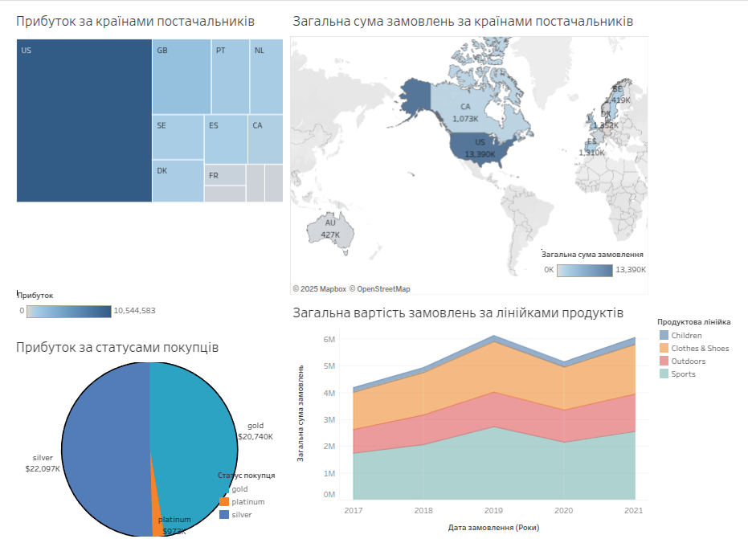

# Wholesale_And_Retail_Orders_Analysis

Даний проект спрямований на дослідження та аналіз даних замовлень та продажів продуктів за постачальниками.
Датасет складається з двох таблиць: orders та product-supliers.

[Джерело даних](https://www.kaggle.com/datasets/gabrielsantello/wholesale-and-retail-orders-dataset?select=product-supplier.csv)

Таблиця orders містить дані про продажі та має наступні стовпці:
- Customer ID - ідентифікатор покупця
- Customer Status - статус покупця
- Date Order was placed - дата, коли було зроблено замовлення
- Delivery Date - дата доставки
- Order ID - номер замовлення
- Product ID - ідентифікатор продукту
- Quantity Ordered - кількість замовленого продукту
- Total Retail Price for This Order - загальна вартість замовлення
- Cost Price Per Unit - вартість на одиницю товару

Таблиця orders містить дані про товари та постачальників та має наступні стовпці:
- Product ID - ідентифікатор продукту
- Product Line - лінійка продукту
- Product Category - категорія продукту
- Product Group - група продукту
- Product Name - назва продукту
- Supplier Country - країна постачальника
- Supplier Name - назва постачальника
- Supplier ID - ідентифікатор постачальника

#### Використані інструменти
- Jupiter Notebook
- Python and Python libraries
- Tableau

#### Основна мета

Аналіз спрямований на визначення основної аудиторії покупців, найбільш популярних категорій товарів та прибутку за постачальниками.
Основні показники відображено на [дашборді](https://public.tableau.com/app/profile/margarita.saman/viz/Final_project_17433381473000/Dashboard1?publish=yes) створеного з використанням Tableau.

